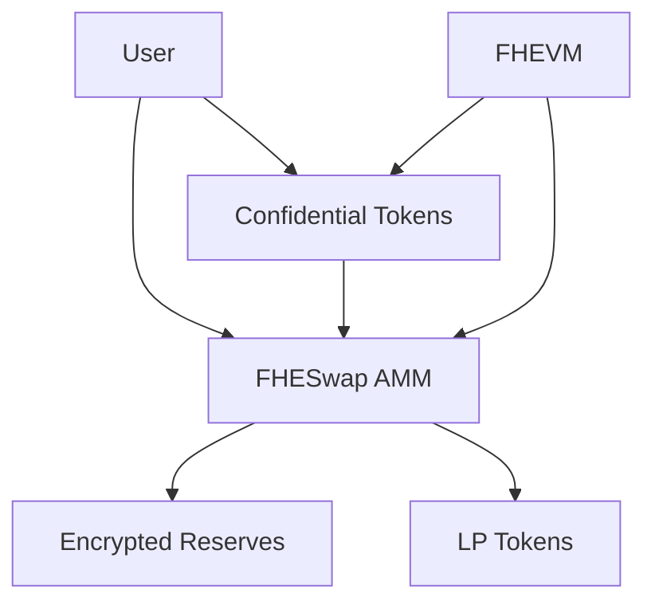

# ZamaSwap

[](https://opensource.org/licenses/MIT)
[](https://soliditylang.org/)
[](https://hardhat.org/)
[](https://docs.zama.ai/fhevm)
[](https://nodejs.org/)

> A privacy-preserving decentralized exchange built with Zama's Fully Homomorphic Encryption (FHE) technology

ZamaSwap is a revolutionary decentralized exchange that leverages Zama's FHEVM to enable completely private token swaps and liquidity management. All transaction amounts, balances, and pool reserves are encrypted, providing inherent protection against MEV attacks and front-running while maintaining a seamless user experience.

## ✨ Features

- 🔐 **Fully Encrypted Trading** - All amounts and balances encrypted using FHE
- 🛡️ **MEV Protection** - Private transactions prevent front-running attacks
- 💧 **Confidential Liquidity** - Add/remove liquidity with complete privacy
- 🏦 **Dual AMM Models** - Basic and enhanced swap implementations
- 🎯 **Institutional Ready** - Perfect for large-scale confidential trading
- 🌐 **Testnet Deployed** - Live on Sepolia testnet

## 🚀 Quick Start

### Prerequisites

- Node.js ≥ 20
- npm ≥ 7.0.0
- Sepolia ETH (for testnet testing)

### Installation

```bash
# Clone the repository
git clone https://github.com/your-username/zamaswap.git
cd zamaswap

# Install dependencies
npm install

# Set up environment variables
npx hardhat vars set MNEMONIC
npx hardhat vars set INFURA_API_KEY
npx hardhat vars set ETHERSCAN_API_KEY  # Optional
```

### Local Development

```bash
# Compile contracts
npm run compile

# Start local FHEVM node
npx hardhat node

# Deploy to local network
npx hardhat deploy --network localhost

# Run tests
npm run test
```

### Testnet Deployment

```bash
# Deploy to Sepolia
npm run deploy:sepolia

# Run testnet tests
npm run test:sepolia
```

## 📋 Table of Contents

- [Architecture](#-architecture)
- [Smart Contracts](#-smart-contracts)
- [Usage Examples](#-usage-examples)
- [API Reference](#-api-reference)
- [Testing](#-testing)
- [Deployment](#-deployment)
- [Security](#-security)
- [Contributing](#-contributing)
- [License](#-license)

## 🏗️ Architecture

ZamaSwap implements a privacy-preserving Automated Market Maker (AMM) using Zama's FHEVM technology. The system consists of three core components:

### Core Components



### Key Concepts

- **FHE Encryption**: All sensitive data encrypted using `euint64`
- **External Encryption**: User inputs encrypted as `externalEuint64` with proofs
- **Access Control**: FHE permissions managed via `FHE.allow()` and `FHE.allowTransient()`
- **Off-chain Division**: Division operations performed off-chain due to FHE limitations

## 📄 Smart Contracts

### ConfidentialFungibleTokenMintableBurnable

Confidential ERC20-like token with mint/burn capabilities.

```solidity
// Key functions
function mint(address to, externalEuint64 amount, bytes memory inputProof) public onlyOwner
function burn(address from, externalEuint64 amount, bytes memory inputProof) public onlyOwner
function confidentialTransfer(address recipient, euint64 amount) external returns (euint64)
function confidentialBalanceOf(address account) external view returns (euint64)
```

### FHESwap

Basic AMM implementation with encrypted reserves.

```solidity
// Key functions
function mint(externalEuint64 amount0, bytes calldata amount0Proof, externalEuint64 amount1, bytes calldata amount1Proof) public
function getAmountOut(externalEuint64 amountIn, bytes calldata amountInProof, address inputToken) external
function swap(externalEuint64 amountIn, bytes calldata amountInProof, externalEuint64 expectedAmountOut, bytes calldata expectedAmountOutProof, externalEuint64 minAmountOut, bytes calldata minAmountOutProof, address inputToken, address to) public
```

### FHESwapSimple

Enhanced AMM with LP token management.

```solidity
// Key functions
function addLiquidity(externalEuint64 amount0, bytes calldata amount0Proof, externalEuint64 amount1, bytes calldata amount1Proof) public returns (euint64 liquidity)
function removeLiquidity(externalEuint64 liquidityAmount, bytes calldata liquidityProof) public returns (euint64 amount0, euint64 amount1)
function getEncryptedLPBalance(address account) external view returns (euint64)
```

## 💡 Usage Examples

### Basic Token Swap

```typescript
// 1. Get amount out
await fheSwap.getAmountOut(encryptedAmountIn, amountInProof, tokenAAddress);

// 2. Get encrypted numerator/denominator
const numerator = await fheSwap.getEncryptedNumerator();
const denominator = await fheSwap.getEncryptedDenominator();

// 3. Decrypt and calculate off-chain
const decryptedNumerator = await fhevm.decrypt(numerator);
const decryptedDenominator = await fhevm.decrypt(denominator);
const amountOut = decryptedNumerator / decryptedDenominator;

// 4. Re-encrypt and swap
const encryptedAmountOut = await fhevm.encrypt(amountOut);
await fheSwap.swap(encryptedAmountIn, amountInProof, encryptedAmountOut, amountOutProof, minAmountOut, minAmountOutProof, tokenAAddress, recipient);
```

### Adding Liquidity

```typescript
// Add liquidity to the pool
await fheSwapSimple.addLiquidity(
  encryptedAmount0,
  amount0Proof,
  encryptedAmount1,
  amount1Proof
);
```

## 📚 API Reference

### FHESwap Contract

| Function | Description | Parameters |
|----------|-------------|------------|
| `mint` | Add liquidity to the pool | `amount0`, `amount0Proof`, `amount1`, `amount1Proof` |
| `getAmountOut` | Calculate output amount | `amountIn`, `amountInProof`, `inputToken` |
| `swap` | Execute token swap | `amountIn`, `amountInProof`, `expectedAmountOut`, `expectedAmountOutProof`, `minAmountOut`, `minAmountOutProof`, `inputToken`, `to` |
| `getEncryptedReserve0` | Get encrypted reserve 0 | None |
| `getEncryptedReserve1` | Get encrypted reserve 1 | None |

### FHESwapSimple Contract

| Function | Description | Parameters |
|----------|-------------|------------|
| `addLiquidity` | Add liquidity and mint LP tokens | `amount0`, `amount0Proof`, `amount1`, `amount1Proof` |
| `removeLiquidity` | Remove liquidity and burn LP tokens | `liquidityAmount`, `liquidityProof` |
| `getEncryptedLPBalance` | Get encrypted LP balance | `account` |
| `getEncryptedTotalSupply` | Get encrypted total LP supply | None |

## 🧪 Testing

### Test Types

```bash
# Local tests
npm run test

# Sepolia testnet tests
npm run test:sepolia

# Quick tests
npm run test:sepolia:quick

# All tests
npm run test:sepolia:all
```

### Custom Test Runner

```bash
# Use the provided test script
./test-quick.sh optimized  # Optimized test suite
./test-quick.sh quick      # Local quick test
./test-quick.sh step       # Step-by-step test
./test-quick.sh full       # Complete test suite
```

### Test Coverage

- ✅ Token minting and burning
- ✅ Confidential transfers
- ✅ Swap functionality
- ✅ Liquidity management
- ✅ LP token operations
- ✅ Access control
- ✅ Error handling
- ✅ Integration tests

## 🚀 Deployment

### Local Deployment

```bash
# Start local node
npx hardhat node

# Deploy contracts
npx hardhat deploy --network localhost
```

### Sepolia Deployment

```bash
# Deploy to Sepolia
npm run deploy:sepolia

# Or use the deployment script
./scripts/deploy-sepolia.sh

# Verify contracts
npm run verify:sepolia
```

### Deployment Scripts

- `deploy/001_deploy_tokens_and_swap.ts` - Main deployment script
- `scripts/deploy-sepolia.sh` - Sepolia deployment automation
- `scripts/mint-sepolia.ts` - Token minting utility

## 🔒 Security

### FHE Security Features

- All sensitive data encrypted using FHE
- Access permissions carefully managed
- No plaintext amounts exposed on-chain
- Protection against MEV and front-running

### Smart Contract Security

- Owner-only functions for critical operations
- Input validation and error handling
- Access control for encrypted operations
- Comprehensive test coverage

### Audit Status

⚠️ **This software is experimental and has not been audited. Use at your own risk.**

## 📊 Project Structure

```
ZamaSwap_contracts/
├── contracts/                    # Smart contracts
│   ├── FHESwap.sol              # Basic AMM
│   ├── FHESwapSimple.sol        # Enhanced AMM
│   └── ConfidentialFungibleTokenMintableBurnable.sol
├── deploy/                      # Deployment scripts
├── scripts/                     # Utility scripts
├── test/                        # Test files
├── tasks/                       # Hardhat tasks
├── typechain-types/             # Generated types
└── hardhat.config.ts            # Hardhat configuration
```

## 🛠️ Development

### Available Scripts

| Script | Description |
|--------|-------------|
| `npm run compile` | Compile contracts |
| `npm run test` | Run local tests |
| `npm run test:sepolia` | Run Sepolia tests |
| `npm run deploy:sepolia` | Deploy to Sepolia |
| `npm run verify:sepolia` | Verify contracts |
| `npm run coverage` | Generate coverage report |
| `npm run lint` | Run linting |
| `npm run clean` | Clean artifacts |

### Environment Variables

| Variable | Description | Required |
|----------|-------------|----------|
| `MNEMONIC` | Wallet mnemonic | Yes |
| `INFURA_API_KEY` | Infura API key | Yes |
| `ETHERSCAN_API_KEY` | Etherscan API key | No |

## 🤝 Contributing

We welcome contributions! Please see our [Contributing Guidelines](CONTRIBUTING.md) for details.

### Development Setup

1. Fork the repository
2. Create a feature branch: `git checkout -b feature/amazing-feature`
3. Make your changes
4. Add tests for new functionality
5. Run the test suite: `npm run test`
6. Commit your changes: `git commit -m 'Add amazing feature'`
7. Push to the branch: `git push origin feature/amazing-feature`
8. Open a Pull Request

### Code Style

- Follow Solidity style guide
- Use TypeScript for tests and scripts
- Add comprehensive tests for new features
- Update documentation as needed

## 📖 Documentation

- [FHEVM Documentation](https://docs.zama.ai/fhevm)
- [FHEVM Hardhat Setup](https://docs.zama.ai/protocol/solidity-guides/getting-started/setup)
- [FHEVM Testing Guide](https://docs.zama.ai/protocol/solidity-guides/development-guide/hardhat/write_test)
- [OpenZeppelin Confidential Contracts](https://docs.openzeppelin.com/contracts/5.x/confidential)

## 🆘 Support

- 📧 **Issues**: [GitHub Issues](https://github.com/your-username/zamaswap/issues)
- 💬 **Discussions**: [GitHub Discussions](https://github.com/your-username/zamaswap/discussions)
- 📚 **Documentation**: [Project Wiki](https://github.com/your-username/zamaswap/wiki)

## 📄 License

This project is licensed under the MIT License - see the [LICENSE](LICENSE) file for details.

## 🙏 Acknowledgments

- [Zama](https://zama.ai/) for the FHEVM technology
- [OpenZeppelin](https://openzeppelin.com/) for the confidential contracts
- [Hardhat](https://hardhat.org/) for the development framework

## ⚠️ Disclaimer

This software is experimental and has not been audited. Use at your own risk. The FHE technology is still under development, and there may be bugs or security vulnerabilities. Always test thoroughly before using in production environments.

---

<div align="center">
  <strong>Built with ❤️ using Zama's FHEVM technology</strong>
  <br>
  <a href="https://zama.ai/">Zama</a> • 
  <a href="https://docs.zama.ai/fhevm">FHEVM Docs</a> • 
  <a href="https://github.com/your-username/zamaswap">GitHub</a>
</div>